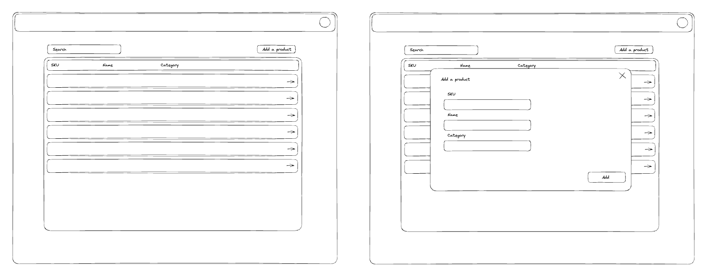

This is a [Next.js](https://nextjs.org/) project bootstrapped with [`create-next-app`](https://github.com/vercel/next.js/tree/canary/packages/create-next-app).

## Getting Started

First, run the development server:

```bash
npm run dev
```

Open [http://localhost:3000](http://localhost:3000) with your browser to see the result.

Had some fun getting more familiar with NextJS, Vercel and Supabase. It is currently hosted on Vercel at https://product-search-neon.vercel.app/. Running locally will connect to the same DB as the one hosted in Supabase.

Made a rough design with excalidraw.com (insert company name in black box, etc.):


Some open questions in the code itself that can and should be iterated on for future versions. Enjoy! :)
